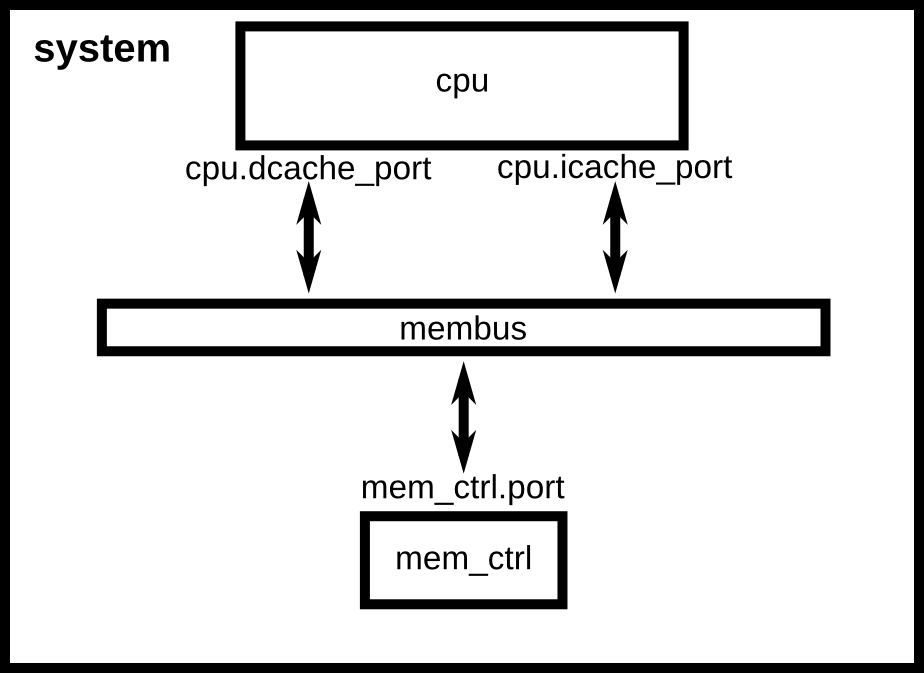
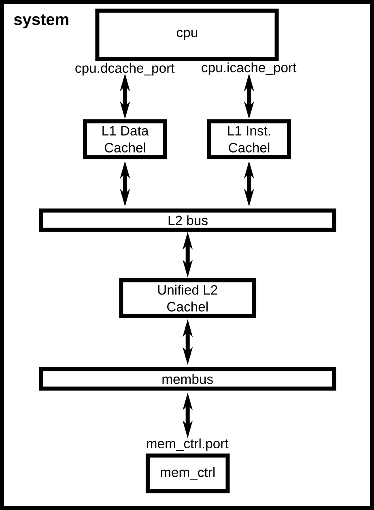

# Lab 1：gem5 模拟器入门

## 实验目标

gem5 是一个开源的计算机体系结构模拟器，官方对它的定义是：

> gem5 is a modular discrete event driven computer system simulator platform.
> —— [Learning gem5: Introduction](https://www.gem5.org/documentation/learning_gem5/introduction/)

这句话里有三个关键词。**模块化（modular）**：系统由可替换、可重新参数化的部件搭成；**离散事件驱动（discrete event driven）**：时间以事件为单位推进，而不是按真实时钟流逝；**平台（platform）**：gem5 提供的是一堆预制部件，而不是一个固定的模拟器。

gem5 由 C++ 和 Python 两部分组成：C++ 负责底层部件的时序行为，Python 负责描述"这台机器由哪些部件构成、怎么连接、参数是多少"。正因为这种分工，探索不同的 SoC 架构——加速器性能、互连拓扑、存储带宽——通常只需要改 Python 配置脚本，而不必改动模拟器本身。

gem5 有两种运行模式：**全系统模式（FS mode）**模拟包含设备和操作系统的完整系统；**系统调用仿真模式（SE mode）**只运行用户态程序，系统调用由模拟器直接代为完成。本次实验全程使用 SE 模式。

完成本次实验后，你应当能够：

1. 在 Linux 环境下从源码编译 gem5；
2. 读懂 gem5 的 Python 配置脚本，理解 SimObject、端口（port）与内存系统的连接关系，并能按需修改；
3. 把自己编写的程序作为负载在 gem5 上运行，从 `stats.txt` 中提取统计量，并用它回答一个具体的架构设计问题。

## 一、环境准备

gem5 只能在 Linux 下编译运行。本讲义的依赖列表、编译命令和全部实验数据都是在 **Ubuntu 22.04** 上验证的。其他发行版或版本的包名、依赖版本可能有差异，需要自行解决。

Windows 用户常见的三种做法，本实验都接受，请自行选择：

| 做法 | 特点 |
| --- | --- |
| WSL2 | 编译速度接近原生，可直接配合 VS Code 使用，安装也最省事 |
| 虚拟机（VMware / VirtualBox） | 配置简单，但编译较慢 |
| 双系统 | 性能最好，但安装麻烦、切换需要重启 |

如果你已经有可用的 Linux 环境（实验室服务器、云主机等），直接用即可。

### 关于 WSL2

安装方法可以参考微软官方文档：

- [安装 WSL](https://learn.microsoft.com/zh-cn/windows/wsl/install)
- [WSL 的基本命令](https://learn.microsoft.com/zh-cn/windows/wsl/basic-commands)（列出、迁移、卸载发行版等）

两点补充：

- 安装时可以直接指定本实验验证过的发行版：`wsl --install -d Ubuntu-22.04`；装好后用 `wsl -l -v` 确认 `VERSION` 一列是 `2`。
- **预留磁盘空间**：gem5 源码加编译产物大约需要 **7 GB**。WSL 默认装在 C 盘，如果 C 盘紧张，可按上面第二篇文档里 `wsl --manage` 的说明把发行版迁到其他盘。

## 二、安装 gem5

!!! danger "官方 Building 页的依赖列表在 Ubuntu 22.04 上装不上"
    gem5 官方文档 [Building gem5](https://www.gem5.org/documentation/learning_gem5/part1/building/) 给出的依赖命令里包含 `python-dev` 和 `python` 两个包，它们在 Ubuntu 20.04 之后**已经不存在**，照抄会导致整条 `apt install` 失败。该页面至今未更新。

    请使用下面这份在 Ubuntu 22.04 上实测通过的列表。本实验中凡遇到本讲义与官方文档冲突之处，以本讲义为准。

### 1. 安装依赖

```bash
sudo apt-get update
sudo apt-get install -y \
    build-essential scons python3-dev git m4 \
    zlib1g zlib1g-dev libprotobuf-dev protobuf-compiler libprotoc-dev \
    libgoogle-perftools-dev libboost-all-dev libhdf5-serial-dev \
    libcapstone-dev libpng-dev libelf-dev pkg-config \
    python3-venv wget cmake
```

!!! warning "apt 下载慢？"
    国内网络下建议先更换为国内镜像源（清华 TUNA、阿里云、华为云均可），参考[清华镜像源帮助页面](https://mirrors.tuna.tsinghua.edu.cn/help/ubuntu/)。

### 2. 获取源码

gem5 的默认分支是滚动更新的，直接 `git clone` 取到的代码随时间变化，可能与本讲义对不上。**本讲义的全部命令、输出和实验数据都基于 release `v25.1.0.1`**（对应 commit `c8222cc`），请指定这个版本：

```bash
git clone --depth 1 --branch v25.1.0.1 https://github.com/gem5/gem5.git
cd gem5
```

`--depth 1` 表示只取这个版本的快照、不下载完整提交历史，可以省下大量时间和流量。

!!! tip "clone 失败或过慢"
    如果 `git clone` 中途报 `RPC failed` / `early EOF`，可以改为直接下载同一版本的压缩包（约 16 MB）：
    ```bash
    wget https://github.com/gem5/gem5/archive/refs/tags/v25.1.0.1.tar.gz
    tar xzf v25.1.0.1.tar.gz && mv gem5-25.1.0.1 gem5 && cd gem5
    ```

!!! note "怎么确认版本对不对"
    gem5 没有 `--version` 选项，但每次运行都会在输出开头打印版本号：
    ```
    gem5 version 25.1.0.1
    ```
    如果你用了别的版本，讲义里给出的 tick 数、缺失率等参考数值可能对不上，某些 API 也可能有变化。可以在 Lab 报告里注明你实际使用的版本。

### 3. 编译

```bash
scons build/X86/gem5.opt -j$(nproc)
```

`-j` 后面是并行编译的任务数，一般取 CPU 核心数。

编译成功的标志是最后出现这一行，且没有 `scons: *** ` 开头的报错：

```
scons: done building targets.
```

!!! warning "编译很慢，但不是卡死了"
    编译过程中终端长时间没有新输出是正常的。助教在 64 核服务器上实测耗时 **37 分钟**，普通笔记本请按 **1.5~2 小时**预期。

!!! danger "不要照抄官方文档的编译目标"
    官方文档编译的是 `build/ALL`，包含全部 ISA 和全部 Ruby 一致性协议，**比 `build/X86` 慢得多**。本实验只用 X86，请照上面写。

## 三、实验任务

本次实验共三个任务，分别对应三个层次：**完整运行 gem5**（任务 1）、**改动 gem5 配置**（任务 2）、**基于 gem5 仿真器做简单的架构探索**（任务 3）。

### 任务 1：跑通第一个仿真

gem5 源码自带一个已经编译好的测试程序 `tests/test-progs/hello/bin/x86/linux/hello`，不需要你自己编译。

先用官方提供的最简配置脚本运行它：

```bash
./build/X86/gem5.opt configs/learning_gem5/part1/simple.py
```

这个配置里只有一个 CPU、一条内存总线和一个内存控制器，**没有任何 cache**：



*图 1　`simple.py` 所描述的系统结构。图片来自 gem5 官方文档 [Creating a simple configuration script](https://www.gem5.org/documentation/learning_gem5/part1/simple_config/)。*

留意输出末尾的这两行：

```
Hello world!
Exiting @ tick 489304000 because exiting with last active thread context
```

再用带两级 cache 的配置跑**同一个程序**：

```bash
./build/X86/gem5.opt configs/learning_gem5/part1/two_level.py
```

这个配置在 CPU 和内存总线之间插入了 L1 指令 cache、L1 数据 cache 和一个统一的 L2 cache：



*图 2　`two_level.py` 所描述的系统结构。图片来自 gem5 官方文档 [Adding cache to the configuration script](https://www.gem5.org/documentation/learning_gem5/part1/cache_config/)。*

**请把两次运行的完整输出留下来。**

除了终端输出，gem5 每次运行还会在 `m5out/` 目录下留下几个文件，本实验会反复用到其中两个：

| 文件 | 内容 |
| --- | --- |
| `stats.txt` | 本次仿真的全部统计量 |
| `config.ini` | 本次仿真中所有部件的参数快照 |

打开 `m5out/stats.txt`，找到开头的 `simSeconds`、`simTicks` 和 `simFreq` 三行——它们能说明 tick 究竟是什么单位。

!!! warning "`m5out/` 会被下一次运行覆盖"
    gem5 默认总是输出到 `m5out/`，所以跑完 `two_level.py` 之后，`m5out/` 里已经是第二次运行的结果了。要同时保留多次运行的结果，用 `--outdir` 指定不同的输出目录：

    ```bash
    ./build/X86/gem5.opt --outdir=m5out_simple configs/learning_gem5/part1/simple.py
    ```

    注意 `--outdir` 是 **gem5 自己的选项**，必须写在配置脚本路径**之前**；写在后面会被当成传给脚本的参数。后面的任务会经常用到它。

### 任务 2：读懂并修改配置脚本

gem5 的配置脚本描述的是"这台机器由哪些部件组成、怎么连起来"。本任务分三步：先读懂脚本（2.1），再动手给它加一个新参数（2.2），最后验证（2.3）。

**开始之前**，请打开 `configs/learning_gem5/part1/simple.py` 和 `two_level.py`，对照上面两张图通读一遍，重点看清楚：

- `System`、`SrcClockDomain`、`MemCtrl`、`X86TimingSimpleCPU` 这些 **SimObject** 分别扮演什么角色；
- 端口是怎么连的：`cpu.icache_port`、`membus.cpu_side_ports`、`membus.mem_side_ports` 之间的连接关系；
- 对照图 1 和图 2，`two_level.py` 比 `simple.py` 多做了什么，才把 cache 插进 CPU 和内存总线之间。

官方文档的 [Creating a simple configuration script](https://www.gem5.org/documentation/learning_gem5/part1/simple_config/) 和 [Adding cache to the configuration script](https://www.gem5.org/documentation/learning_gem5/part1/cache_config/) 两页逐行讲解了这两个脚本，可以参照阅读。

#### 2.1 脚本已经支持哪些参数

先看看 `two_level.py` 接受哪些参数：

```bash
./build/X86/gem5.opt configs/learning_gem5/part1/two_level.py --help
```

输出是：

```
usage: two_level.py [-h] [--l1i_size L1I_SIZE] [--l1d_size L1D_SIZE]
                    [--l2_size L2_SIZE]
                    [binary]

positional arguments:
  binary

options:
  -h, --help           show this help message and exit
  --l1i_size L1I_SIZE  L1 instruction cache size. Default: 16KiB
  --l1d_size L1D_SIZE  L1 data cache size. Default: 64KiB
  --l2_size L2_SIZE    L2 cache size. Default: 256KiB
```

也就是说，**三个 cache 的容量已经是可配置的了**：

| 参数 | 默认值 |
| --- | --- |
| `--l1i_size` | 16 KiB |
| `--l1d_size` | 64 KiB |
| `--l2_size` | 256 KiB |

任务 3 要用的 `--l2_size` 就在其中，**不需要你添加，直接用即可**。

值得注意的是，打开 `two_level.py` 你会发现这三个参数在里面一行都找不到——它自己只声明了一个位置参数 `binary`。它们实际上声明在同目录的 `caches.py` 里，而且是写在 cache 类的**类体**中：

```python
class L2Cache(Cache):
    """Simple L2 Cache with default values"""

    # Default parameters
    size = "256KiB"
    ...

    SimpleOpts.add_option("--l2_size", help=f"L2 cache size. Default: {size}")
```

`SimpleOpts` 内部持有一个**模块级**的 `ArgumentParser`，所有配置脚本共用它。`two_level.py` 开头有一行 `from caches import *`，导入时 `caches.py` 的类体会被执行，这三个 `add_option` 就注册进了那个共享的 parser——所以命令行上写 `--l2_size` 才能生效。2.2 里你要添加的参数用的是同一套机制。

#### 2.2 动手：让脚本能把参数传给被模拟的程序

`two_level.py` 目前只能运行不带参数的程序。注意它的这一行：

```python
process.cmd = [args.binary]
```

`process.cmd` 就是被模拟程序看到的 `argv`，现在它只有 `argv[0]`——也就是说，凡是需要靠命令行参数来控制行为的程序（比如控制问题规模的程序），这个脚本都没法正确地把它跑起来。要给脚本补上这个能力。

把 `two_level.py` 复制一份为 `two_level_args.py`（**必须放在同一目录 `configs/learning_gem5/part1/` 下**），然后做两处修改：

1. **声明一个新的位置参数**，用来接收要传给被模拟程序的若干个参数。写法仿照 `caches.py` 里 `--l2_size` 那一行；
2. **修改 `process.cmd`**，把这些参数接在 `args.binary` 后面。

关于 `SimpleOpts.add_option()` 怎么用——看它的实现就明白了（`configs/common/SimpleOpts.py`）：

```python
parser = ArgumentParser()

def add_option(*args, **kwargs):
    """Call "add_option" to the global options parser"""
    if called_parse_args:
        m5.fatal("Can't add an option after calling SimpleOpts.parse_args")
    parser.add_argument(*args, **kwargs)
```

**它就是 argparse 的 `add_argument()` 的透传**，只是名字叫 `add_option`，并且所有脚本共用同一个模块级 `parser`（就是 2.1 里说的那个）。因此 argparse 的全部用法都适用。

本题的关键在于：你要接收的是**数量不定**的若干个参数（可能一个，也可能一个都没有）。请查阅 argparse 文档中 `add_argument()` 的 **`nargs`** 参数，选择合适的取值，并注意设置默认值。

!!! warning "声明必须写在 parse_args() 之前"
    `two_level.py` 中有一行 `args = SimpleOpts.parse_args()`。在它之后再调用 `add_option()` 会直接 `m5.fatal` 退出，报错 `Can't add an option after calling SimpleOpts.parse_args`。你新加的声明必须在这一行**之前**。

#### 2.3 验收

仍然用任务 1 的 `hello` 作为负载。`hello` 自己不读 `argv`，多给它几个参数它也照样打印 `Hello World!`，所以不能靠终端输出来判断参数有没有传进去——要看 gem5 的另一个输出文件 **`config.ini`**。

gem5 每次运行都会在输出目录里生成 `config.ini`，它是本次仿真中**所有 SimObject 的完整参数快照**，其中就包括 `Process` 的 `cmd`。在 gem5 根目录下运行：

```bash
./build/X86/gem5.opt --outdir=m5out_args \
    configs/learning_gem5/part1/two_level_args.py --l2_size=1MB \
    tests/test-progs/hello/bin/x86/linux/hello 12345 foo
grep '^cmd=' m5out_args/config.ini
```

应当输出：

```
cmd=tests/test-progs/hello/bin/x86/linux/hello 12345 foo
```

`cmd=` 对了，说明脚本改成功了。顺便在同一个 `config.ini` 里找到 `[system.l2cache]` 段，确认它的 `size=1048576`（1 MiB，默认值是 `262144` 即 256 KiB）——这说明 `--l2_size` 确实作用到了硬件配置上，而不只是被 argparse 解析了一下。任务 3 会大量依赖这一点。

!!! tip "三个容易卡住的地方"
    - `binary` 是**位置参数**，不是 `--binary`。写成 `--binary=.../hello` 会被 argparse 拒绝。
    - 新脚本**必须放在 `configs/learning_gem5/part1/` 目录下**，因为它开头有 `from caches import *`。放到别处运行会报 `ModuleNotFoundError: No module named 'caches'`。
    - `binary` 和你新加的参数都是位置参数。argparse 在处理多个位置参数时有确定的匹配规则，如果发现 `cmd=` 里 `argv[0]` 的值不对（比如 `hello` 跑到后面去了，或者 gem5 报找不到可执行文件），检查一下两者的声明顺序和 `nargs` 取值。

### 任务 3：用模拟器做一次设计空间探索

前两个任务都是在跑现成的仿真器配置。这个任务里，我们用 gem5 回答一个真实的 SoC 设计问题：**这个负载应该配多大的 L2 cache？**

#### 3.1 关于负载：埃拉托色尼筛法

本次实验使用的负载是埃拉托色尼筛法（Sieve of Eratosthenes），由古希腊数学家埃拉托色尼提出，用于求出 [2, N] 区间内的全部素数。算法流程很简单：

1. 将 [2, N] 从小到大排成一行；
2. 标出列表中第一个未被筛去的数，它是素数，然后筛去它的所有倍数；
3. 重复第 2 步，最后被标出的就是 [2, N] 内的所有素数。

以 N = 10 为例：

**a. 将 [2, 10] 排成一行**


**b. 标出第一个数 2，筛去所有 2 的倍数**


**c. 标出下一个未被筛去的数 3，筛去所有 3 的倍数**


**d. 标出 5，筛去所有 5 的倍数**


**e. 标出 7。此时所有被标出的数 2、3、5、7 就是 [2, 10] 内的全部素数**


选这个算法作为负载，是因为它有两个对本实验很有用的性质：结果**有明确的正确性判据**（素数个数是确定的），以及它的访存行为集中在一个大小完全可控的数组上——这正是任务 3 要观察的东西。

#### 3.2 准备负载

把上面的算法写成 `sieve.cpp`：

```cpp
#include <cstdio>
#include <cstdlib>
#include <vector>

int main(int argc, char *argv[]) {
    int N = (argc > 1) ? std::atoi(argv[1]) : 10000;
    std::vector<char> composite(N + 1, 0);
    int count = 0;
    for (int i = 2; i <= N; ++i) {
        if (!composite[i]) {
            ++count;
            for (long long j = (long long)i * i; j <= N; j += i)
                composite[j] = 1;
        }
    }
    printf("primes below %d: %d\n", N, count);
    return 0;
}
```

!!! warning "必须静态链接"
    gem5 的 SE 模式没有动态链接器，动态链接的程序无法运行。编译时必须加 `-static`：
    ```bash
    g++ -O2 -static -o sieve sieve.cpp
    ```

!!! note "为什么用 `vector<char>` 而不是 `vector<bool>`"
    C++ 标准库会把 `vector<bool>` 按 bit 打包，工作集会缩小 8 倍，本任务要观察的现象就被掩盖了。请照上面写。

先在本机直接运行，确认结果正确：

| N | 正确输出 |
| --- | --- |
| 10,000 | `primes below 10000: 1229` |
| 200,000 | `primes below 200000: 17984` |
| 2,000,000 | `primes below 2000000: 148933` |

然后用任务 2 改好的脚本，在 gem5 上跑一次（约 1 分钟）：

```bash
./build/X86/gem5.opt configs/learning_gem5/part1/two_level_args.py ./sieve 200000
```

输出里应当出现 `primes below 200000: 17984`。**如果出现的是 `primes below 10000: 1229`，说明命令行参数没有真正传到被模拟的程序里**——回到任务 2 检查 `process.cmd`。这个错误不会抛任何异常，参数是被默默忽略的，程序用的是它自己的默认值 10000。

#### 3.3 先做一个简单估算

**在跑任何仿真之前**，先回答：当 N = 2,000,000 时，这个程序的主要工作集有多大？（提示：看 `composite` 这个数组占多少字节。）

根据你算出的工作集大小，**预测**：L2 cache 要多大，性能才会出现明显改善？把你的预测写下来。

#### 3.4 扫描 L2 容量

用任务 2 改好的脚本，固定负载 N = 2,000,000，只改 L2 容量：

```bash
for L2 in 256kB 512kB 1MB 2MB 4MB 8MB 16MB; do
    ./build/X86/gem5.opt --outdir=out_L2$L2 \
        configs/learning_gem5/part1/two_level_args.py \
        --l2_size=$L2 ./sieve 2000000
done
```

每次运行约需 1 分钟。结果在各自 `out_L2*/stats.txt` 里，需要的统计量有三个：

| 统计量 | 含义 |
| --- | --- |
| `simSeconds` | 被模拟机器上经过的时间（**不是**你等待的时间） |
| `system.cpu.dcache.overallMissRate::total` | L1 数据 cache 缺失率 |
| `system.l2cache.overallMissRate::total` | L2 缺失率 |

把七组数据整理成表格，并画出 `simSeconds` 随 L2 容量变化的曲线。

#### 3.5 分析

请回答下面四个问题：

1. 七次运行的 **L1 数据 cache 缺失率**是多少？为什么改 L2 容量不影响它？
2. 曲线的**拐点**出现在哪个容量？这个位置和你在 3.3 里算出的工作集大小是什么关系？和你的预测一致吗？
3. 拐点之后继续增大 L2，性能还有提升吗？请用数据说明。
4. **如果你来设计这颗 CPU**，只考虑这一个负载，你会选多大的 L2？

## 四、提交要求

### 交一个压缩包

打包成 `Lab1_学号_姓名.zip`，里面放两个文件：

| 文件 | 内容 |
| --- | --- |
| `Lab1_学号_姓名.pdf` | 实验报告 |
| `two_level_args.py` | 任务 2 中你写的配置脚本（**文件名保持不变**） |

提交至教学网。截止时间以教学网公告为准。

### 报告内容

按下面的顺序写即可。每一项都对应讲义里的一个位置，记录实验过程和结果即可。

**0. 环境说明**

- 用的是什么环境（WSL2 / 虚拟机 / 双系统）、发行版与版本
- gem5 版本、编译命令
- 安装过程中卡住的地方和你的解决办法；一路顺利就写"无"

**1. 任务 1**

- `simple.py` 与 `two_level.py` 两次运行的完整输出，**必须包含 `Exiting @ tick ...` 那一行**
- 用一两句话回答：tick 是什么？和 `stats.txt` 中的 `simSeconds` 关系是什么？为什么同一个程序加了 cache 之后 tick 数会降这么多？

**2. 任务 2**

- **你的改动**：贴出 `two_level_args.py` 相对 `two_level.py` 改动的那两处，并说明你为什么这样选 `nargs` 的取值
- **2.3 的验收输出**：`config.ini` 中的 `cmd=` 行，以及 `[system.l2cache]` 段的 `size=`

**3. 任务 3**

- 3.2 中在 gem5 上运行 `./sieve 200000` 的输出
- **3.3 的计算与预测**：工作集大小的计算过程（不是只给结果），以及你在看到任何仿真数据**之前**写下的预测
- **3.4 的数据表**：七行，列为 L2 容量、`simSeconds`、L1d 缺失率、L2 缺失率；以及 `simSeconds` 随 L2 容量变化的曲线图
- **3.5 四个问题的回答**

### 其他说明

- **请自己运行仿真器得到实验数据。** 仿真器版本不同导致数值有出入是正常的，**趋势**一致即可。
- 实验报告没有格式要求，记录实验过程和结果即可，但**每一个结论都要有数据支撑**。

## 五、参考资料

gem5 官方文档 **Learning gem5** 系列（英文）：

- [Introduction](https://www.gem5.org/documentation/learning_gem5/introduction/) —— gem5 是什么、两种运行模式、支持的 ISA 与 CPU 模型
- [Building gem5](https://www.gem5.org/documentation/learning_gem5/part1/building/) —— 编译流程与常见错误（⚠️ 依赖列表已过时，见第二节）
- [Creating a simple configuration script](https://www.gem5.org/documentation/learning_gem5/part1/simple_config/) —— 逐行讲解 `simple.py`
- [Adding cache to the configuration script](https://www.gem5.org/documentation/learning_gem5/part1/cache_config/) —— 逐行讲解 `two_level.py` 与 `caches.py`
- [Understanding gem5 statistics and output](https://www.gem5.org/documentation/learning_gem5/part1/gem5_stats/) —— `stats.txt` 中各统计量的含义

其他：

- [gem5 官网](https://www.gem5.org/) 与 [源码仓库](https://github.com/gem5/gem5)；本实验使用的版本：[v25.1.0.1](https://github.com/gem5/gem5/releases/tag/v25.1.0.1)
- [清华 TUNA 镜像源使用帮助](https://mirrors.tuna.tsinghua.edu.cn/help/ubuntu/)

本讲义中的系统结构图（图 1、图 2）取自 gem5 官方文档。
